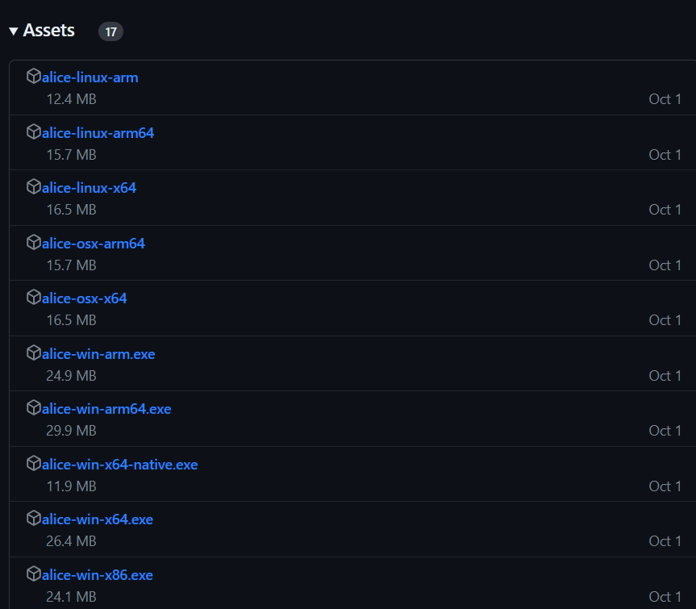

## はじめに
AliceScriptは、軽量な.NETエコシステム上で動作するインタプリタ型のプログラミング言語です。AliceScriptはC#やPythonをルーツとしているため、C、C#、JavaScript、Pyhton、PHPのプログラマーであればすぐに使いこなすことができます。
AliceScriptについて詳しく知るには、[AliceScriptのツアー](../welcome)を参照してください。

この記事では、はじめににAliceScriptで開発を始めるために必要な作業を確認します。(すでにAliceScriptを使用している場合はこのセクションを飛ばしても構いません)。
次に、AliceScriptを使って簡単なコンソールアプリケーションを例として作成し、AliceScriptの基本的な事項を解説します。

## 動作環境の構築

AliceScriptを使用したアプリの開発について説明する前に、まずAliceScriptを実行できるコンピューターを用意する必要があります。

AliceScriptの実装であるLosettaは、現代のWindowsとmacOS、多くのLinuxディストリビューションの主要なアーキテクチャで動作します。
サポートしている動作環境の一覧は、以下の折りたたみを開いて確認してください。

??? "動作環境の一覧"
    |OS|バージョン|アーキテクチャ|
    |---|---|---|
    |Windows|7 SP1、8.1|x64、x86|
    |Windows 10|Version 1607以降|x64、x86、ARM64|
    |Windows 11|Version 22000以降|x64、x86、ARM64|
    |Windows Server(Core含む)|2012以降|x64、x86|
    |Nano Server|Version 1809以降|x64|
    |macOS|10.15以降|x64、ARM64|
    |Alpine Linux|3.13以降|x64、ARM64、ARM32|
    |CentOS Linux|7|x64|
    |CentOS Stream Linux|8|x64|
    |Debian|10以降|x64、ARM64、ARM32|
    |Fedora|36以降|x64|
    |openSUSE|15以降|x64|
    |Oracle Linux|7以降|x64、ARM64|
    |Red Hat Enterprise Linux(RHEL)|7以降|x64、ARM64|
    |SUSE Enterprise Linux(SLES)|12 SP5以降|x64|
    |Ubuntu|16.04、18.04、20.04以降|x64、ARM64、ARM32|

    - Linuxのそのほかのディストリビューションでも、一定の要件を満たすことで動作する可能性があります。[.NET Support and Compatibility for Linux Distributions](https://github.com/dotnet/core/blob/main/linux-support.md)を参照してください。
    - macOSでは、Rosetta 2上での動作をサポートします
    - ARM版Windows 11では、x64エミュレーター上での動作をサポートします

また、以下の環境では[AliceSister](../general/alice-sister.md)を使用することで動作します。この場合、.NET Framework 4.5.2のインストールが必要です。

|OS|バージョン|アーキテクチャ|
|---|---|---|
|Windows|8、7、Vista|x64、x86|
|Windows Server|2008 R2 SP1、2008 SP2|x64、x86|

> [!TIP] ヒント:非サポート環境での動作
> WSOFTでは動作をサポートできませんが、サポートされる環境以外でAliceScriptを動作させる必要がある場合、AliceSisterとMonoを導入することで動作する可能性があります。

### Losettaの導入
サポートされる環境では、Losettaをダウンロードする必要があります。[GitHubリポジトリ](https://github.com/WSOFT-Project/Losetta/releases)から、最新のものをダウンロードするか、[WSOFTダウンロードセンター](https://download.wsoft.ws/AliceScript)から安定版をダウンロードできます。

#### GitHubリポジトリからダウンロードする
1. https://github.com/WSOFT-Project/Losetta/releases にアクセスします
2. 最新バージョンの項目の、Assetsをクリックします。
3. 自分の環境にあったファイルをクリックし、ダウンロードします。
4. ダウンロードしたファイルを、`alice.exe`に名前変更します。

3について、ファイル名は以下のような法則に基づき名前付けされています。

```txt
alice-<OS名>-<アーキテクチャ名>
```

たとえば、Windows 10の64ビット環境に導入する場合は、`alice-win-x64`を、MシリーズのCPUを搭載したmacOSに導入する場合は`alice-osx-arm64`をダウンロードします。

!!!tip "OSの判別"
    WindowsやWindows Serverなどを使用している場合は、`win`を、macOSを使用している場合は`osx`を、Linuxを使用している場合は`linux`を選択します。

!!!tip "アーキテクチャの判別"
    IntelやAMD製のプロセッサを使用している(これはコンピューター貼ってあるステッカーで判別できます)場合、64ビットであれば`x64`を、32ビット(これはよく古いコンピューター採用されています)であれば`x86`を選択します。また、ARM製のプロセッサを使用している場合は`arm64`を選択します。

名称変更したらそのファイルを適当な場所に移動します。このとき、移動先のファイルパスを控えておきます。

[チュートリアル:AlicePackageの関連付け](./ice-to-association.md)を参考に、AlicePackageをコンピューター関連付けます。

`alice -v`コマンドを実行し、以下のように出力されれば環境構築は完了です。

```bash title="出力"
AliceScript バージョン <SAIM_Version> (Losetta <IMPL_Version> on Win32NT)
```

#### WSOFTダウンロードセンターからダウンロードする
`curl`コマンドを使って必要なファイルを導入できます。

```bash title="シェル"
curl -OL https://download.wsoft.ws/<Download_ID>/Download
```

この時のダウンロードIDは、環境に応じて次のように変化します。

|ID|環境|
|---|---|
|WS144|Linux-x64|
|WS145|Linux-arm|
|WS146|Linux-arm64|
|WS147|macOS-x64|
|WS148|Windows-x64|
|WS149|Windows-x86|
|WS150|Windows-ARM64|
|WS151|Windows-ARM|

たとえば、64ビット環境のLinuxにLosettaを導入するには、次のようなコマンドを実行します。

```bash title="シェル"
curl -OL https://download.wsoft.ws/WS144/Download
```

!!!note "ダウンロードの検証"
    ダウンロードが壊れておらず、正当なものであるかを確かめるためにチェックサムを取得して検証できます。
    `https://api.wsoft.ws/download/detail?id=<Download_ID>&feature=hash`を取得し、そのHash値がダウンロードしたファイルのSHA512ハッシュと同じかどうかを確かめます。

次に以下のコマンドを順に実行します。実行には管理者権限が必要です。

```bash title="シェル"
sudo chmod +x Download
sudo mv Download /usr/local/bin/alice
alice version
```
`alice version`コマンドを実行し、以下のように出力されれば環境構築は完了です。

```bash title="出力"
AliceScript バージョン <SAIM_Version> (Losetta <IMPL_Version> on Unix)
```

### はじめてのAliceScriptの実行
`alice`コマンドを実行して、対話実行モードに入ります。次に、以下のようなコマンドを入力します。

```cs title="AliceScript"
print("Hello,World!");
```

```raw title="出力"
Hello,World!
```

### スクリプトの作成と実行
`script.txt`という名前のテキストファイルを作成し、そこに先ほどのように`print("Hello,World!");`と書き込んで保存します。

次のようなコマンドを実行して、スクリプトファイルを実行できます。

```bash title="シェル"
alice script.txt
```

以上で基礎的なチュートリアルは終了です。
