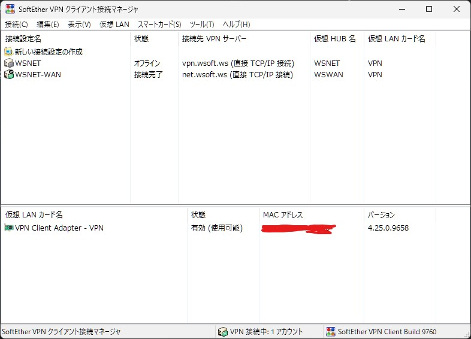
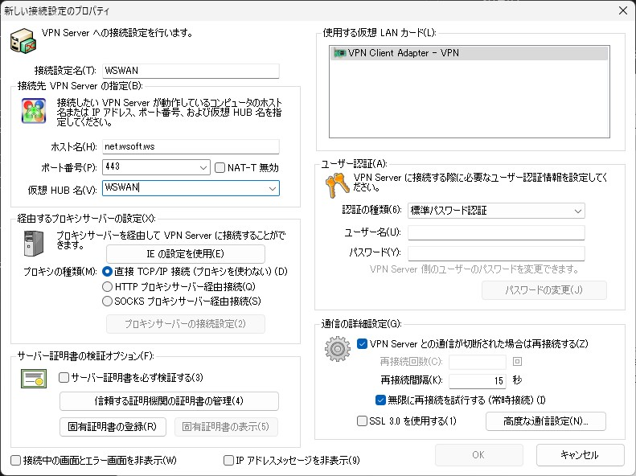
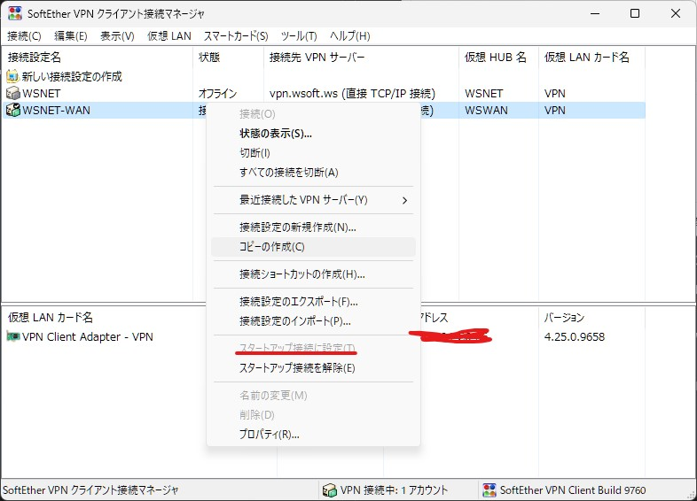

### はじめに
Windows環境では、SoftEtherを使用してWSNET/WANに接続することができます。Windows環境では**SoftEtherを使用してWSWANに接続する**ことをおすすめします。
AndroidやiOSなど、SoftEtherがサポートされない環境では[OpenVPNを使用してWSWANに接続する](./connetct-from-openvpn.md)こともできます。

初めにSoftEtherダウンロードセンターから各プラットフォームのSoftEther VPNClientをダウンロードしてください。

- [SoftEtherダウンロードセンター](https://www.softether-download.com/ja.aspx)

また、WSWANのユーザーアカウントを準備してください。現在、WSWAN接続サービスの一般公開およびオープンテストは行っていません。

### 接続マネージャからの設定
SoftEtherVPNClientがインストールされている環境で**SoftEtherVPN クライアント 接続マネージャ**を起動し、**新しい接続設定の作成**をクリックします。

!!!note "仮想LANカードの作成"
    初めてSoftEtherVPNクライアントを使用する場合は仮想LANカードの作成が必要です。

### 接続設定の入力
**新しい接続設定のプロパティ**ウィンドウに、必要事項を入力します。

**接続設定名**には任意の名前を指定できます。わかりやすいものを使用してください。

**ホスト名**には接続先のサーバーの名前を指定します。WSWANの場合は`net.wsoft.ws`を、WSNETの場合は`vpn.wsoft.ws`を指定します。

**ポート名**には接続先のサーバーのポート番号を指定します。WSWANの場合は`443`か`5223`を、WSNETの場合は`5223`を指定します。

**ユーザー認証**は、標準パスワード認証を使用できます。WSWANのユーザー名とパスワードを指定してください。

**IPアドレスメッセージを非表示**にすることができます。

### 接続
完成した接続設定を右クリックし、**接続**を押して接続できます。

また、**スタートアップ接続に設定**すると、システムが起動したときに自動的に接続できます。